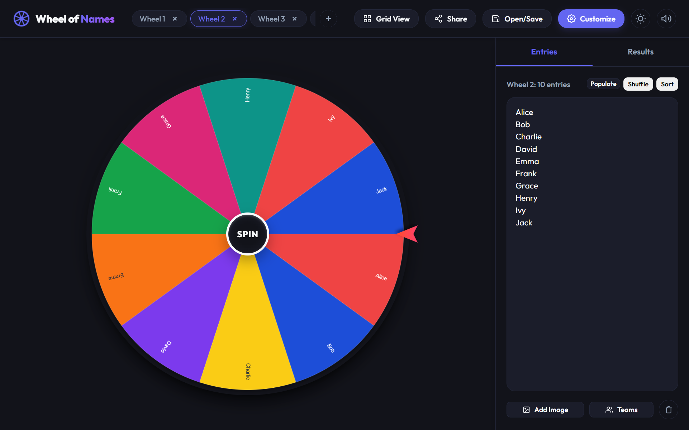
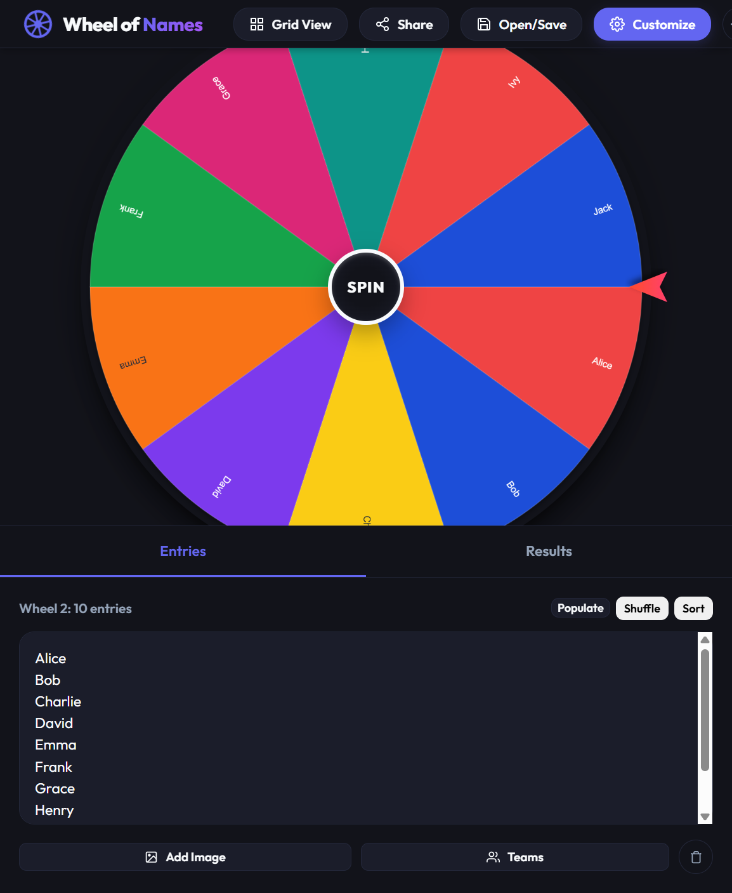
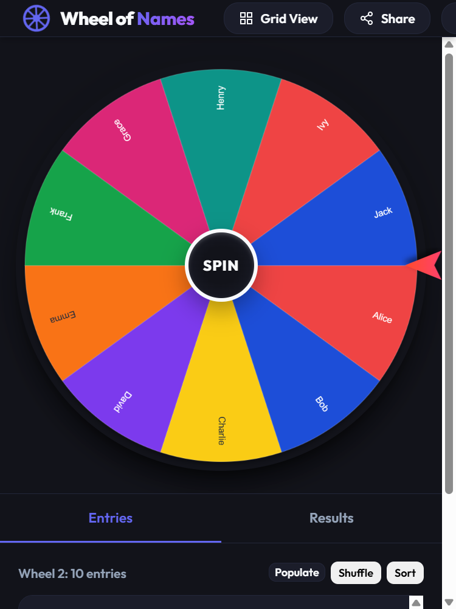

# 🎡 Spinner Wheels | Reborn

A modern, highly interactive, and visually stunning client-side Single Page Application (SPA) recreation of popular web-based spinner wheels. It features advanced customization options, dynamic audio synthesis, full state persistence, and support for multi-wheel layouts.

---

## 📸 Screenshots

### 🖥️ Desktop Layout
A clean dual-column layout with the interactive canvas wheel on the left and the entries list editor, tab strips, and customization controllers on the right.


### 📱 Tablet & Mobile Responsiveness
Resizes dynamically to fit smaller viewports, stacking the wheel and the list panel cleanly to maximize workspace utility.
<table>
  <tr>
    <td align="center" width="50%">
      <b>Tablet View</b><br>
      
    </td>
    <td align="center" width="50%">
      <b>Mobile View</b><br>
      
    </td>
  </tr>
</table>

---

## ✨ Features

- **Interactive Canvas Wheel**:
  - Custom colors and slice weights (e.g. `Alice *3` to triple its probability).
  - Slice images and text rendering with responsive scaling.
  - Snaps exactly to the center (50% position) of segments to ensure the pointer never rests on a boundary.
- **Winner Modal "Next Wheel" Flow**:
  - Unified winner action flow: clicking "Next Wheel" dismisses the modal, removes the winner (if configured), and rotates focus to the next tab in sequence.
  - Automatic winner removal timeout extends this transition seamlessly.
- **Dynamic Web Audio Synthesis**:
  - Sound effects (clicker ticks, chimes, fanfares, gongs, applause) are synthesized programmatically on the fly.
  - Eliminates external asset loading times and dead links.
- **Multi-Wheel Grid Layout**:
  - Switch between **Solo View** and **Grid View** to display multiple wheels side-by-side.
  - Clicking any wheel in grid mode shifts sidebar list focus to that wheel.
- **Quick Populate & Tools**:
  - Quickly fill elements with letters (A-Z), numbers, or days of the week.
  - Shuffle and sort entries instantly.
  - Built-in **Team Generator** to divide list entries randomly into groups.
- **Full State Persistence**:
  - Auto-saves active wheels, entries, color palettes, and configurations to local storage.
- **Shareable Compression Hash**:
  - Share your custom wheel designs instantly using shareable base64 state URLs.

---

## 🚀 Getting Started

### Prerequisites
Make sure you have Node.js installed.

### Setup and Running
1. Clone this repository or open the project folder in your terminal.
2. Install development dependencies:
   ```bash
   npm install
   ```
3. Run the development server locally:
   ```bash
   npm run dev
   ```
4. Open your browser and navigate to the local URL (usually localhost:5173).
